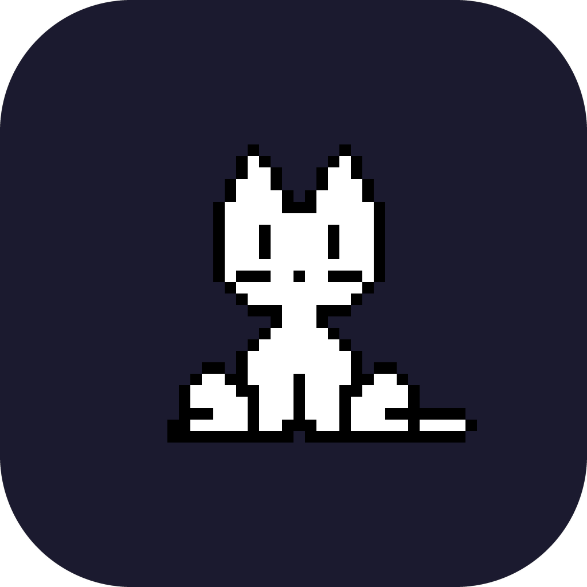
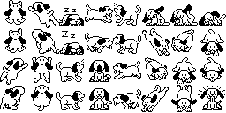
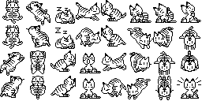
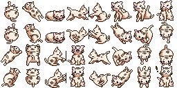
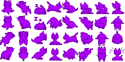

<div align="center">



# OnekoMac

**A pixel cat that lives in your menu bar and chases your cursor — forever.**

*Native macOS app. Metal GPU rendering. 120 Hz. No Electron. No bloat.*

[](https://github.com/hellov3an/OnekoMac/releases)
[](https://swift.org)
[](LICENSE)
[](https://github.com/hellov3an/OnekoMac/stargazers)

---

<!-- Replace with an actual screen recording GIF -->


</div>

---

## What is this?

In 1989, a Japanese programmer put a tiny cat on the desktop that chased the cursor.  
It became one of the most beloved pieces of software ever written.

**OnekoMac** brings that cat back — as a proper native macOS app, rebuilt from scratch:

- Runs as a floating overlay above every window, every Space, every full-screen app
- Rendered with Metal at up to 120 Hz (ProMotion-aware)
- Follows your cursor with the original `oneko.js` animation logic, 1:1 ported
- Idles, scratches the wall, falls asleep if you leave it alone
- Lives quietly in your menu bar

No Dock icon. No subscriptions. No tracking. Just a cat.

---

## Skins

| Classic | Dog | Tora | Maia | Vaporwave |
|:-------:|:---:|:----:|:----:|:---------:|
|  |  |  |  |  |

Switch between skins at any time from the settings panel.

---

## Install

### Download (recommended)

1. Go to [**Releases**](https://github.com/hellov3an/OnekoMac/releases/latest)
2. Download `OnekoMac.dmg`
3. Drag to Applications
4. Launch — the cat appears immediately

> The app will ask for no permissions. If your cursor is moving, the cat follows it.

### Homebrew

```sh
brew install --cask hellov3an/tap/onekomac
```

### Build from source

```sh
git clone https://github.com/hellov3an/OnekoMac
cd OnekoMac
xcodegen generate
open OnekoMac.xcodeproj
```

Requires Xcode 15+, macOS 13+ SDK, and [xcodegen](https://github.com/yonaskolb/XcodeGen).

---

## Features

- **Metal GPU renderer** — CAMetalLayer + CVDisplayLink + triple-buffered command queue
- **120 Hz** — frame-synced to ProMotion displays, smooth on 60 Hz too
- **oneko.js logic** — 8-directional movement, idle states, scratch, sleep
- **5 pixel-art skins** — sourced from [kyrie25/spicetify-oneko](https://github.com/kyrie25/spicetify-oneko)
- **Floating settings panel** — skin picker with live previews, FPS counter
- **Auto-update checker** — checks GitHub Releases, one click to update
- **Zero CPU at idle** — CVDisplayLink only renders when needed
- **Universal Binary** — Apple Silicon and Intel

---

## How it works

The cat runs a 100 ms logic tick (matching the original JavaScript timing):

1. Compute distance to cursor
2. If far → pick 8-directional movement animation → move by 10 pts/tick
3. If near → idle, then scratch, then sleep

Sprites come from a 256×128 px GIF atlas (8×4 grid of 32×32 px frames).  
The Metal shader converts top-left screen coordinates to NDC in one pass.

---

## Creating a skin

Skins are 256×128 px GIF files arranged as an 8-column × 4-row sprite sheet — the same format as the original `oneko.js`.

### Sprite sheet layout

```
col →   0    1    2    3    4    5    6    7
row 0  [nwl][nwl][slp][slp][scW][scS][scS][scS]
row 1  [nwl][nwl][slp][slp][scW][ SE][ SW][ S ]
row 2  [NE ][NE ][E  ][trd][W  ][SE ][SW ][S  ]
row 3  [NE ][NE ][E  ][idl][W  ][SE ][SW ][alt]
```

Each cell is **32×32 px**. The idle frame is at **col 3, row 3**.

### Step 1 — Make the GIF

- Canvas: exactly **256 × 128 px**
- Each cell: **32 × 32 px** (pixel art, no anti-aliasing)
- Name it `oneko-<id>.gif` (e.g. `oneko-ghost.gif`)
- Keep the same animation grid as the originals — copy one of the bundled GIFs as a starting point

### Step 2 — Test it locally

Drop your GIF in `Resources/Sprites/`, then add its ID to `SkinManager.skinIDs` in `Skins/SkinManager.swift`:

```swift
static let skinIDs = ["classic", "dog", "tora", "maia", "vaporwave", "ghost"]
```

Build and run — your skin appears in the picker immediately.

### Step 3 — Submit to the Marketplace

1. **Fork** this repo
2. Put your GIF in `Marketplace/` (create the folder if needed)
3. Add an entry to `.github/marketplace/manifest.json`:

```json
{
  "id": "ghost",
  "name": "Ghost",
  "author": "yourGitHubHandle",
  "bundled": false,
  "url": "https://raw.githubusercontent.com/hellov3an/OnekoMac/main/Marketplace/oneko-ghost.gif"
}
```

4. Open a **Pull Request** — once merged, the skin appears in every user's Marketplace panel without an app update

> **Tip:** for the `url` field in your PR, use your fork's raw URL first so the skin can be previewed before merge.

---

## Contributing

PRs welcome — skins, bug fixes, new features, translations.

Bug reports → [Issues](https://github.com/hellov3an/OnekoMac/issues)

---

## Credits

- Original **oneko** — Masayuki Koba, 1989
- Sprite artwork — [kyrie25/spicetify-oneko](https://github.com/kyrie25/spicetify-oneko)
- Built with Swift + Metal by [@hellov3an](https://github.com/hellov3an)

---

<div align="center">

*If this made you smile, hit the ⭐ — it helps more people find the cat.*

</div>
